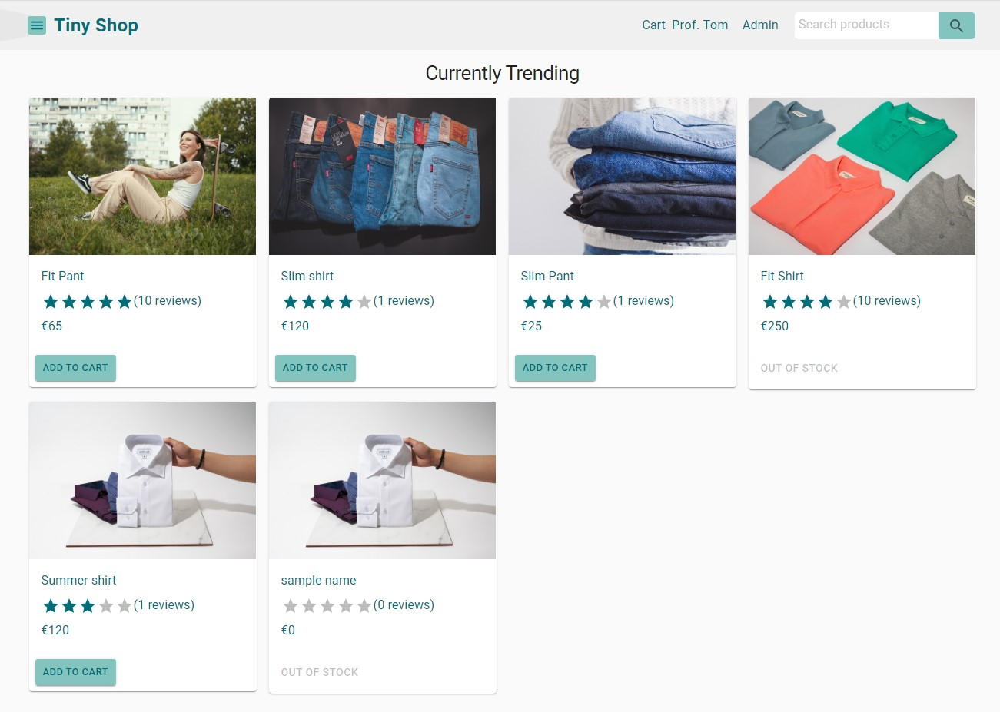
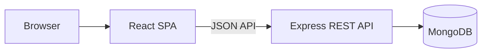

# Tiny Shop - Single-Page Application (SPA)

Tiny Shop is a full-stack e-commerce prototype. The project uses a React frontend, an Express REST API, and MongoDB.



## Thesis context

My thesis compares three approaches to modern web development by implementing the same e-commerce application three times:

| Approach | Application | Rendering strategy | Repository |
| --- | --- | --- | --- |
| **SPA** | **Tiny Shop** | **The browser renders the interface after loading the JavaScript application** | **This repository** |
| SSR | Small Shop | The server renders HTML for each request | [View SSR implementation](https://github.com/fhjoy/ssr) |
| SSG | Little Shop | Pages are pre-rendered during the build | [View SSG implementation](https://github.com/fhjoy/ssg) |

The three applications intentionally have closely matched features and visual designs. This keeps the application domain and user interface stable so that the rendering strategy remains the main comparison variable.

The comparison considers flexibility, performance, data fetching, security, learning curve, popularity, and SEO.

[View the thesis poster](docs/thesis-poster.pdf)

## How the SPA version works

The browser receives an HTML shell and React renders the application on the client. React Router handles navigation without full page reloads, while Axios communicates with the Express backend through JSON-based REST endpoints.



## Features

- Product catalogue and product detail pages
- Search, category filtering, rating filtering, sorting, and pagination
- Shopping cart with stock validation
- User registration, sign-in, profile management, and order history
- Shipping, payment, order review, and checkout workflow
- PayPal payment integration
- Product ratings and customer reviews
- JWT-based authentication and protected routes
- Admin dashboard for products, orders, and users
- MongoDB persistence through Mongoose models
- REST API for products, users, orders, reviews, and seed data

## Technology stack

| Area | Technologies |
| --- | --- |
| Frontend | React 17, React Router, React Context with `useReducer`, React Bootstrap, Axios |
| Backend | Node.js, Express.js, REST API |
| Data | MongoDB, Mongoose |
| Authentication | JSON Web Token, bcrypt.js |
| Payments | PayPal React SDK |
| Metadata | React Helmet Async |

## Local setup

### Prerequisites

- Node.js and npm
- Local MongoDB or a MongoDB Atlas connection
- Optional PayPal sandbox client ID

### 1. Clone the repository

```bash
git clone https://github.com/fhjoy/spa.git
cd spa
```

### 2. Configure the backend

Create `backend/.env`:

```env
MONGODB_URI=mongodb://localhost/spa
JWT_SECRET=replace_with_a_private_secret
PAYPAL_CLIENT_ID=your_paypal_sandbox_client_id
PORT=5000
```

`PAYPAL_CLIENT_ID` is optional for basic local exploration; the application falls back to the PayPal sandbox configuration.

### 3. Start the backend

```bash
cd backend
npm install
npm start
```

The API runs at `http://localhost:5000`.

### 4. Start the frontend

Open another terminal:

```bash
cd spa/frontend
npm install
npm start
```

The frontend runs at `http://localhost:3000`.

### 5. Seed sample data

Open `http://localhost:5000/api/seed` once to add the sample users and products.

Development accounts:

| Role | Email | Password |
| --- | --- | --- |
| Administrator | `admin@example.com` | `123456` |
| Customer | `user@example.com` | `123456` |

These credentials are for local demonstration only.

## SPA characteristics explored

### Strengths

- Fast client-side navigation after the initial application load
- Clear separation between frontend and backend through REST APIs
- Rich interactive state and reusable React components
- Independent frontend and backend development workflows

### Trade-offs

- The initial experience depends on downloading and executing JavaScript
- Search engines receive less complete HTML without additional rendering support
- Client-side state, loading states, and API errors require careful handling
- Frontend and backend deployment must be coordinated

## Project status

This repository is an academic prototype created in 2022 for a controlled architecture comparison. It is preserved as evidence of the implementation and research process, not as a production storefront. Dependencies should be reviewed and upgraded before production use.

